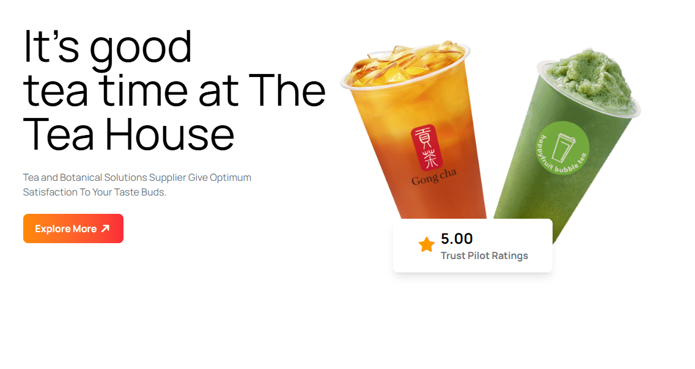
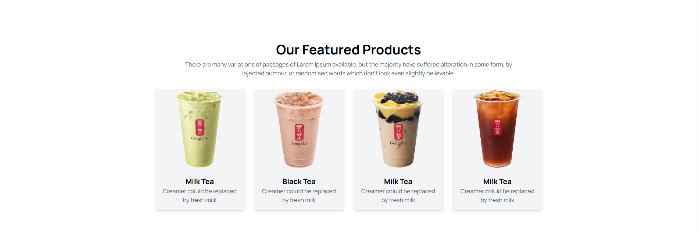
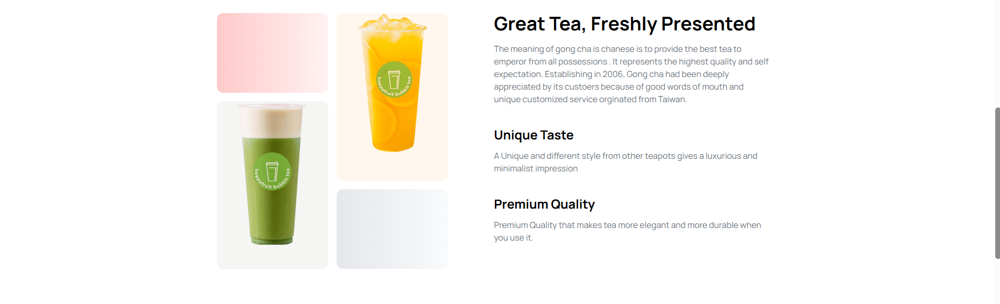
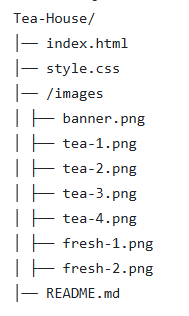

# 🍵 Tea House Website

A modern and responsive Tea House website built using HTML, Tailwind CSS, and Font Awesome.  
This project showcases a clean UI design for a tea brand landing page with product display, testimonials, and footer sections.

---

## 📌 Overview

Tea House is a frontend landing page project designed to practice modern web development using Tailwind CSS.  
It includes multiple sections like hero banner, featured products, customer reviews, and a stylish footer.

---

## 🚀 Features

- Fully responsive design (mobile, tablet, desktop)
- Modern UI with Tailwind CSS
- Hero banner with CTA button
- Featured product grid section
- Customer review/testimonial section
- Stylish footer with newsletter form
- Font Awesome icons integration

---

## 🛠️ Tech Stack

- HTML5
- Tailwind CSS
- JavaScript (CDN only)
- Font Awesome
- Google Fonts (Manrope)

---

## 📸 Screenshots

### Hero Section


### Featured Products



### UI Preview


---

## 📁 Project Structure



---

## ▶️ How to Run

1. Clone the repository
```bash
git clone https://github.com/your-username/tea-house.git
